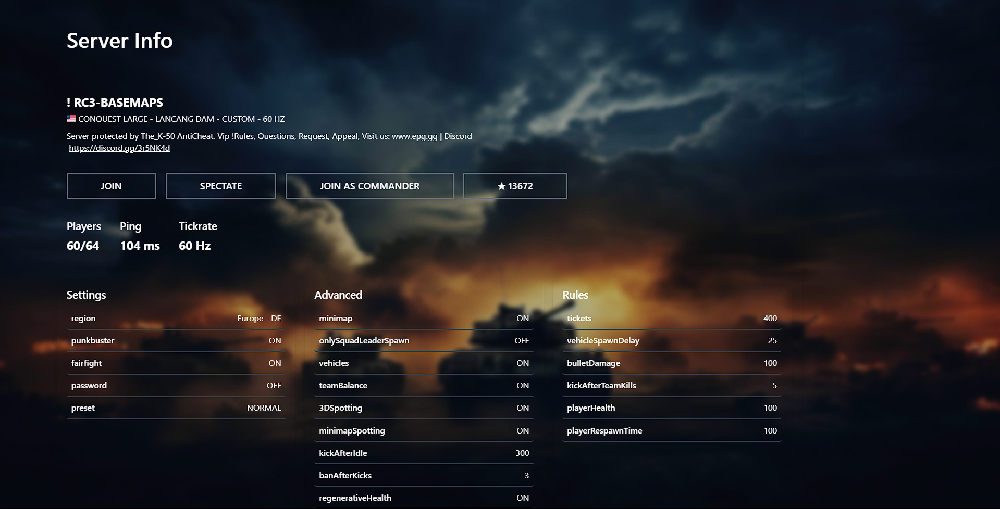
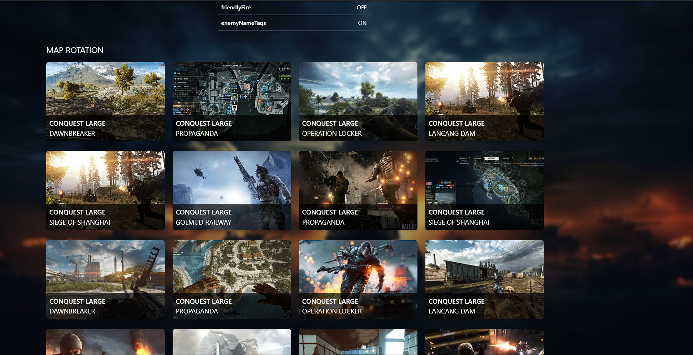

# BattleField 4 UI (Full-Stack)

## Overview
This project is a **full-stack web application** that integrates a **React frontend** with a **Nodejs backend**. The application displays dynamic content fetched from the server, providing seamless interaction between the frontend and backend. The app is designed with a focus on **UI/UX**, ensuring a smooth and intuitive experience for users.

---

## Preview

**(Live)**: [Full-Stack Web App](https://fog4.kalehub.com) - click on image or this link to view the app.

## Features
- **Responsive Design**: The app is fully responsive, ensuring a seamless experience across devices.
- **Smooth User Interface**: Interactive and user-friendly layout with modern UI elements.
- **Dynamic Content**: Fetches and displays content dynamically from the backend.
- **Intuitive Controls**: Easy-to-use interface with clearly labeled buttons and sections.
- **Modern Design**: Clean, minimalist design with a focus on usability and ease of navigation.

---
## Tech Stack Used
This project utilizes a combination of modern technologies to build a seamless full-stack web application:

- **Frontend**:
  - **React**: A JavaScript library for building user interfaces.
  - **TypeScript**: Adds type safety and improves code quality.
  - **CSS**: Used for styling the app (with custom styles or frameworks like Tailwind CSS).
  
- **Backend**:
  - **Node.js**: A JavaScript runtime for building the backend server.
  - **Express.js**: A web framework for Node.js, used to handle API requests.
  
- **APIs**:
  - **RESTful APIs**: For communication between the frontend and backend.

- **Tools**:
  - **Git/GitHub**: Version control and collaboration platform.
  - **Vercel**: For deployment.

---

## Contact
For questions, feedback, or collaboration opportunities, feel free to reach out:

- **Pratik Kale**: [Portfolio](https://kalehub.com)
- **GitHub**: [@Pratikkale26](https://github.com/Pratikkale26)
- **X**: [@Pratikkale26](https://x.com/pratikkale26)
- **Linkedin**: [@Pratikkale26](https://www.linkedin.com/in/pratikkale26/)
